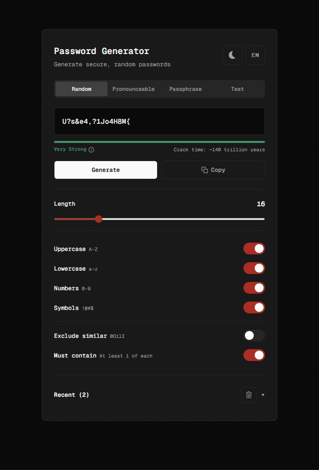

<div align="center">

#  Password Generator

**A secure, feature-rich password generator with real-time strength analysis, multi-mode generation, and a clean Mono UI.**

[](https://kutluyigitturk.github.io/PasswordGenerator/)

</div>

---

## 📸 Preview

<div align="center">



</div>

---

<div align="center">

## 🛠️ Tech Stack


</div>

---

## ✨ Features

| Feature | Description |
|---------|-------------|
| 🎲 **Random Mode** | Generates passwords from a customizable character pool (uppercase, lowercase, numbers, symbols). Uses `Math.random()` with retry logic to guarantee character requirements. |
| 🗣️ **Pronounceable Mode** | Creates readable passwords using syllable-based generation from 100+ common syllable patterns (e.g. `ProVenTalMent`). Supports optional random capitalization and vowel-to-number substitution (a→4, e→3, i→1, o→0). |
| 📝 **Passphrase Mode** | Combines random words from a 60+ word bank (English and Turkish) with a configurable separator, capitalization, and optional number suffix (e.g. `Alpine-Beacon-Canyon-42`). |
| 🔍 **Test Mode** | Type your own password to analyze its strength, entropy, and detect common patterns. Press Enter to save it to history. |
| 🔒 **Strength Analysis** | Real-time entropy calculation in bits. Estimates brute-force crack time assuming 10 billion attempts/sec (modern GPU cluster). Color-coded bar from Very Weak to Very Strong. |
| 🛡️ **Pattern Detection** | Detects weak patterns: repeating groups (`asdasdasd`), keyboard walks (`qwerty`), low unique characters, single character type, and all-same characters. Automatically downgrades strength rating. |
| ⚠️ **Breach Detection** | Checks generated passwords against a set of 40+ commonly leaked passwords. Also detects repeated characters (`aaaaaa`) and sequential numbers (`123456`). |
| 🌗 **Dark / Light Theme** | Animated sun-moon SVG toggle inspired by [web.dev](https://web.dev). CSS transitions with elastic easing for smooth icon morphing. |
| 🌍 **TR / EN Language** | Slide animation toggle. All UI strings stored in a centralized `translations.js` object for easy localization. |
| 🎚️ **Toggle Switches** | Spring-based animations powered by Framer Motion (`stiffness: 700, damping: 30`). Satisfying elastic snap on every toggle. |
| 🎬 **Rolling Animation** | Password reveal effect — characters scramble and resolve left-to-right over 10 frames at 40ms intervals. |
| 📋 **Copy to Clipboard** | One-click copy with cross-fade icon animation and visual feedback (1.5s timeout). |
| 📜 **Password History** | Stores last 50 generated passwords with mode icon, timestamp, and strength badge. |
| 📊 **Similarity Score** | Compares each new password to the previous one using Levenshtein distance. Shows percentage with color-coded warnings. |
| ✨ **Interactive Background** | Canvas-based dot pattern that reacts to mouse movement — dots repel from cursor with scale and opacity effects. |

---

## 🔧 How It Works

### Entropy Calculation

```
Pool Size = (26 if lowercase) + (26 if uppercase) + (10 if digits) + (33 if symbols)
Entropy = Password Length × log₂(Pool Size)
```

### Crack Time Estimation

```
Seconds = 2^entropy / 10,000,000,000 (10 billion attempts/sec)
```

Then converted to human-readable format (seconds → minutes → hours → days → years). Values beyond ~trillion years display as "Longer than the age of the universe".

### Pattern Detection

Analyzes passwords for common weaknesses:
- **High severity** (caps strength to Very Weak): repeating groups, all-same characters, very few unique characters
- **Medium severity** (drops strength one level): keyboard walk patterns (qwerty, asdf, zxcv)
- **Low severity** (informational): single character type usage

### Similarity Score

Uses **Levenshtein distance** — counts the minimum single-character edits (insertions, deletions, substitutions) needed to change one password into another:

```
Similarity% = (1 - levenshtein(a, b) / max(a.length, b.length)) × 100
```

---

## 📁 Project Structure

```
password-generator/
├── assets/
│   ├── icon.svg                    → Favicon and README icon
│   └── screenshot-dark.jpg         → README preview image
├── public/
│   └── assets/
│       └── icon.svg                → Public favicon
├── src/
│   ├── components/
│   │   ├── BGPattern.jsx               → Interactive canvas dots background
│   │   ├── PassphraseMode.jsx          → Word count, separator, language, toggles
│   │   ├── PasswordDisplay.jsx         → Password output box with rolling animation
│   │   ├── PronounceableMode.jsx       → Length slider + capitalize/number toggles
│   │   ├── RandomMode.jsx              → Length slider + character toggles
│   │   ├── RecentSection.jsx           → History list + similarity scores
│   │   ├── StrengthBar.jsx             → Color-coded bar + entropy tooltip + crack time + pattern warnings
│   │   ├── TestMode.jsx                → User password input + breach check
│   │   └── Toggle.jsx                  → Reusable spring-animated toggle switch
│   ├── utils/
│   │   ├── generators.js               → Password generation algorithms + breach check
│   │   ├── strength.js                 → Entropy, crack time, pattern detection, Levenshtein distance
│   │   └── translations.js             → All UI strings (EN + TR)
│   ├── App.css                         → App-level styles
│   ├── App.jsx                         → App entry point
│   ├── index.css                       → Global styles + sun-moon CSS animation
│   ├── main.jsx                        → React DOM render entry
│   └── PasswordGenerator.jsx           → Main component — assembles everything
├── .gitignore
├── eslint.config.js
├── index.html                          → HTML shell
├── LICENSE
├── package.json
├── README.md
└── vite.config.js                      → Vite + GitHub Pages config
```

---

## 🚀 Getting Started

```bash
git clone https://github.com/kutluyigitturk/PasswordGenerator.git
cd PasswordGenerator
npm install
npm run dev
```

Open `http://localhost:5173/` in your browser.

## 📤 Deployment

```bash
npm run deploy
```

Deploys to GitHub Pages via `gh-pages` branch.

---

## 📝 License

MIT

---

<div align="center">

**Built with ☕ and curiosity.**

</div>
